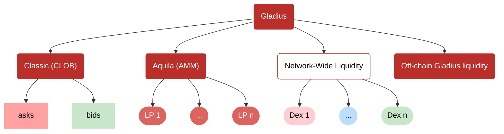

# Rubicon Docs

import { Callout } from "/components/Callout";
import { QuickLinks, QuickLink } from "/components/QuickLinks.jsx";

<QuickLinks>
	<QuickLink 
		title="FAQ" 
		icon="installation" 
		href="/faq" 
		description="New to Rubicon? Visit our Frequently Asked Questions"></QuickLink>
	<QuickLink
		title="Guides"
		icon="openBook"
		href="/guides/integration/filler"
		description="Learn to Trade, Integrate Programatically, and Earn!"
	></QuickLink>
	<QuickLink
		title="Code Base"
		icon="github"
		href="https://github.com/RubiconDeFi"
		description="Our open-source code base"
	></QuickLink>
	<QuickLink
		title="APIs"
		icon="layers"
		href="/developers/api-guides/rubicon-gladius/gladius-api"
		description="Order API, SDKs, and Subgraphs"
	></QuickLink>
</QuickLinks>

## What is Rubicon?

Rubicon is an open trading platform for [ERC-20](https://ethereum.org/en/developers/docs/standards/tokens/erc-20/) tokens. We believe that all of the world's financial assets will be tokenized; Rubicon is the central hub where they will trade in an efficient, transparent, and trustless fashion. The platform is designed to offer the most efficient ERC20 trading venue: traders get the best price possible and market makers get a low-risk, high-opportunity experience.

Trade tokens on the [Rubicon App](https://app.rubicon.finance/) with Swaps, Limit Orders, and Market Orders.

## Protocol Overview
Rubicon Exchange integrates three core trading mechanisms, providing a comprehensive and efficient trading experience:
1. **Rubicon Classic** – A fully on-chain order book (CLOB), allowing traders to place limit and market orders with precise execution.
2. **Rubicon Aquila** – An Automated Market Maker (AMM), facilitating passive liquidity provision and enabling seamless swaps with algorithmically determined pricing.
3. **Rubicon Gladius** – An intent-based trading system.

The latter is the ultimate execution layer, leveraging every major liquidity source in DeFi:
- **Native Liquidity** – Direct access to Rubicon Classic’s order book and Rubicon Aquila’s AMM pools.
- **Off-Chain Liquidity** – Market makers can submit off-chain orders, ensuring optimal pricing.
- **Network-Wide Liquidity** – Gladius can tap into liquidity from other DEXes, helping capture the best available prices across the ecosystem.

By combining CLOB, AMM, and intent-based trading, Rubicon is able to deliver best-in-class execution, price efficiency, and liquidity depth.

### Rubicon Gladius

Gladius pairs offchain efficiency with onchain settlement, decentralization, and transparency. There are no special permissions - everyone enjoys equal root access.

The core of the protocol is the [`GladiusReactor`](/developers/protocol/rubicon-gladius/contract-overview) smart contract. This smart contract facilitates the encoding and settlement of trades. Order intents are encoded and matched off chain and settled onchain. This enables an efficient, gasless, and totally non-custodial experience of all traders and market makers.

Offchain efficiency derives from our [API](/developers/api-guides/rubicon-gladius/gladius-api) - an open order pool for traders and market makers. Users submit orders as encoded intents where they await execution and settlement by ecosystem actors.

### Rubicon Aquila

[Aquila](https://github.com/RubiconDeFi/aquila) is a fork of Uniswap V2 - one of the most widely used and battle-tested AMMs in DeFi. This provides traders and liquidity providers with a familiar, efficient, and trust-minimized way to engage in on-chain swaps.

### Rubicon Classic

Classic is the first version of Rubicon, included in the protocol, that is a standalone, onchain order book protocol. All action takes place directly on the smart contracts.

[**RubiconMarket**](/developers/protocol/rubicon-classic/rubicon-market/contract-overview) is the core order book contract. It implements order books and a matching engine for peer-to-peer trading of ERC-20 tokens.

[**RubiconRouter**](/developers/protocol/rubicon-classic/rubicon-router/contract-overview) routes token swaps and enables multi-hop swaps if two tokens do not have an underlying order book. It also has helpful view functions for reading data from **RubiconMarket.sol** and contains wrapper functions for handling native ETH throughout the protocol.

#### Order Book Architecture

An [order book](https://en.wikipedia.org/wiki/Order_book) is a list of buy and sell orders for an asset, sorted by price level. It's the best way to reflect supply and demand between two assets. Rubicon provides an efficient order book for high-throughput trading of any ERC20 token pair.

To learn more about Rubicon's market structure and efficiency, visit our docs (TODOD COMING!)

To learn more about Rubicon Classic's order book, visit the [RubiconMarket docs](/developers/protocol/rubicon-classic/rubicon-market/contract-overview).

## Why is this important?

One of crypto's many promises is a decentralized financial system, but today the majority of crypto trading volumes are on centralized exchanges (CEXs). These exchanges have custody of user funds, charge predatory fees, and their incentives are not aligned with their users.

Rubicon is an order book protocol built to bring price discovery onchain. For this space to fulfill its promise, trading needs to be on open protocols, not centralized blackboxes.
