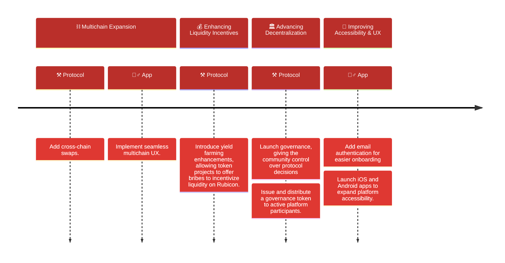

# Rubicon Roadmap

```mermaid
    %%{init: { 'logLevel': 'debug', 'theme': 'default' , 'themeVariables': {
              'cScale0': '#ba2f2a', 'cScaleLabel0': '#ffffff',
              'cScale1': '#ba2f2a', 'cScaleLabel1': '#ffffff',
              'cScale2': '#ba2f2a', 'cScaleLabel2': '#ffffff',
              'cScale3': '#ba2f2a', 'cScaleLabel2': '#ffffff'
       } } }%%
timeline
    section ⛓️ Multichain Expansion
        ⚒️ Protocol : Add cross-chain swaps.
	🧙‍♂️ App : Implement seamless multichain UX.
    section 💰 Enhancing Liquidity Incentives
        ⚒️ Protocol : Introduce yield farming enhancements, allowing token projects to offer bribes to incentivize liquidity on Rubicon.
    section 🏛️ Advancing Decentralization
        ⚒️ Protocol : Launch governance, giving the community control over protocol decisions : Issue and distribute a governance token to active platform participants.
    section 📱 Improving Accessibility & UX
        🧙‍♂️ App : Add email authentication for easier onboarding : Launch iOS and Android apps to expand platform accessibility.
```
