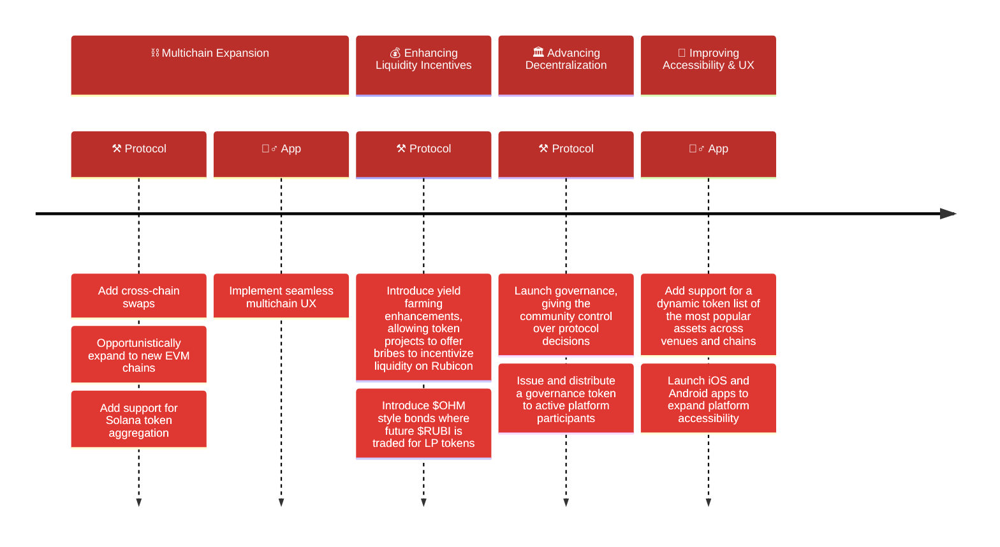

# Rubicon Roadmap

> **Note:** This roadmap represents an early, high-level, and limited overview of planned protocol development. It is not set in stone and will evolve based on community feedback, market conditions, and technological advances. Regular updates will be made to reflect the latest priorities and achievements.

*Last updated: April 23, 2025*
